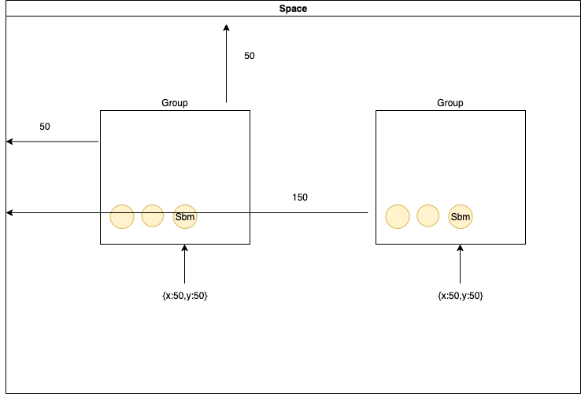

<!-- # mklml
## mklml
### mklml -->


在使用 `SoonSpace.js` 过程中，最常用的加载模型手段是使用 `loadSbm` 去加载。虽然这样能直接达到加载模型的目的，但是对于后续的模型管理非常不利。

例如场景中有十个球体，我们想将球体作为一组模型去移动它的位置，在使用 `loadSbm` 加载的情况下，就需要一个个操作，非常不方便。

这时可以用 `loadSbmToGroup` 将这十个球体加载到一个 `Group` 对象内，直接操作 `Group` 对象的 `position` 属性就能实现同样的需求。

事实上，`Group` 对象就是继承自 `BaseObject3D` 对象。同样拥有这些基础属性。

当 `Sbm` 对象在 `Group` 对象内时，`Sbm` 的 `position` 是相对于 `Group` 的 `position`。

你可以将整个场景想象成一个房间。

当使用 `loadSbm` 时，等于直接把球体放入房间内，需要移动位置时，就要一个个操作。

当使用 `loadSbmToGroup` 时，等于将球体放入一个盒子，直接移动盒子就等于改变了球体的位置。

> 假设左上角为坐标 0,0，此处省略 z 轴。



当移动了 `Group` 之后，内部 `Sbm` 对象的 `position` 是不变的，但是 `Sbm` 对于整个场景来说它的位置已经改变了。

当你想获取 `Sbm` 在场景内的位置(世界坐标)，可以使用 `getWorldPosition`：

```js
// 上图中，得出 {x:200, y:100, z:xxx}
const worldPosition = sbm.getWorldPosition();
```

还有 `getWorldQuaternion`、`getWorldScale` 分别对应 `rotation`、`scale`，详情请参考 Three.js 官网的 `Object3D` 对象。
