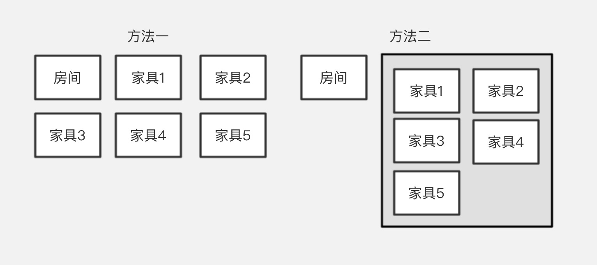
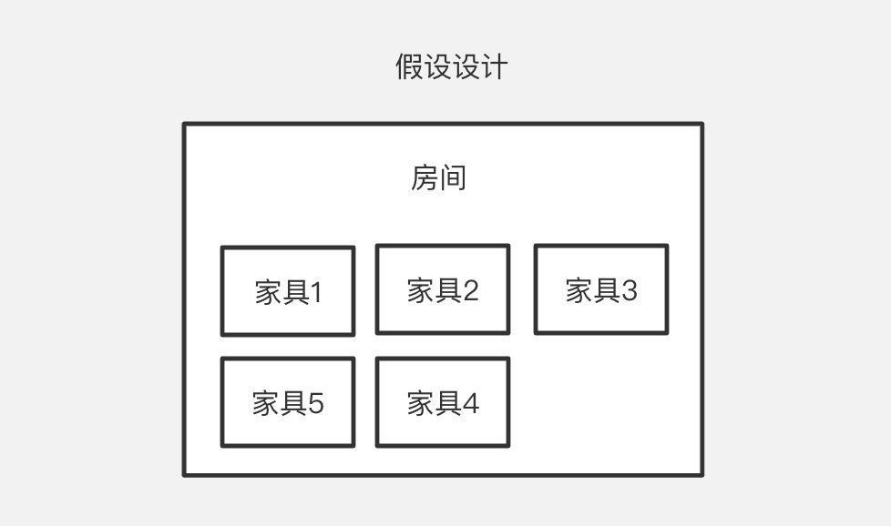

### 在场景中 Group 作为一个抽象空间对象的作用主要有：
  - **批量管理空间对象**
  - **空间相对坐标系**
  - **摆脱主次层次株连性**

<br>

**在详解以上作用前，我们先假设构建一个模型管理场景**

``` tips
场景内有 1 个房间模型，房间内有 5 个不同种类的家具模型。
```
接下来我们要做的是加载模型，以还原场景。
<br>
首先我们先来看俩种加载模型的方法：

```js
ssp.loadSbm(
  // sbmInfo
  { id: 'xx', url: 'xx.sbm' }
)

ssp.loadSbmToGroup(
  // groupInfo
  { id: 'xx' },
  // sbmInfos
  [
    { id: 'xx', url: 'xx.sbm' },
    { id: 'xx', url: 'xx.sbm' },
    ...
  ]
)
```

简单了解俩种方法的使用后，我们可以想到加载模型还原场景的方法有俩种：
  1. **调用 6 次 `loadSbm` 方法分别加载房间模型和家具模型**
  2. **调用 1 次 `loadSbm` 方法加载房间模型，用房间 ID 做为 Group ID 调用 1 次 `loadSbmToGroup` 把家具加载到一个组内**



## 1. 批量管理

**需求：隐藏房间模型时同时隐藏房间内所有家具**

当拿到这个需求时，结合上述讲到的俩种加载方式，你会毫不犹豫的选择第二种加载方式。这里就很好理解了，我们在操作房间隐藏时可以取到房间 ID，
通过 ID 便可以找到 Group 对象将其隐藏。

```js
roomModel.hide();
ssp.getSbmGroupById(roomModel.sid)?.hide()
```

在业务数据层**房间与家具**本就是**层级归属关系**，而 Group 对象其实就是在维护数据层的关联关系。

## 2. 空间相对坐标

什么是相对坐标：以网页页面为例，`div` 在 `body` 内的位置为 `left 50, top: 50`，`button` 又在 `div` 内的位置为 `left 10, top: 10`，那么 `button` 相对于 `body` 的位置就是 `left 60, top: 60`。

在空间场景内，有一棵与 DOM 节点树结构相似的空间对象树，DOM 树的根为 html，空间树的根为 scene。
在空间对象树上的各对象坐标同样受上级影响，呈相对坐标系，并且呈相对的不只有坐标（position），还有角度（rotation）和缩放（scale）。

读到这里你可能会提出一个疑问：**既然空间树是相对坐标系，为什么还要设计 Group 来实现相对坐标? 何不把方法设计为如下？**
```js
ssp.loadSbm(
  // sbmInfo
  { 
    id: 'xx',
    url: 'xx.sbm',
    position: { x: 100, y:  100, z: 100 },
    children: [
      {
        id: 'xx',
        url: 'xx.sbm',
        position: { x: 10, y:  10, z: 10 },
      },
      {
        id: 'xx',
        url: 'xx.sbm',
        position: { x: 50, y:  50, z: 50 },
      },
      ...
    ]
  }
)
```


这种设计方法有许多好处，例如数据结构直观、批量关联操作更简单。但不采用此设计方式的原因只有一个：**对象株连**。

那么用 `Group` 来实现一种假象的相对坐标是怎么做的：
<br>
其实很简单，用一句话描述：**把每一个空间对象都放到 `Group` 内，再为每一个有子集数据的空间对象创建一个 `Group`，同时把自身的世界坐标（包括其它空间属性）赋值给 `Group`。**


这里需要注意一点，根层级（大厦）的 Group ID 在数据层可能为空，需要自己处理。

## 3. 摆脱层次株连

coding...


<!-- 在使用 `SoonSpace.js` 过程中，最常用的加载模型手段是使用 `loadSbm` 去加载。虽然这样能直接达到加载模型的目的，但是对于后续的模型管理非常不利。

例如场景中有十个球体，我们想将球体作为一组模型去移动它的位置，在使用 `loadSbm` 加载的情况下，就需要一个个操作，非常不方便。

这时可以用 `loadSbmToGroup` 将这十个球体加载到一个 `Group` 对象内，直接操作 `Group` 对象的 `position` 属性就能实现同样的需求。

事实上，`Group` 对象就是继承自 `BaseObject3D` 对象。同样拥有这些基础属性。

当 `Sbm` 对象在 `Group` 对象内时，`Sbm` 的 `position` 是相对于 `Group` 的 `position`。

你可以将整个场景想象成一个房间。

当使用 `loadSbm` 时，等于直接把球体放入房间内，需要移动位置时，就要一个个操作。

当使用 `loadSbmToGroup` 时，等于将球体放入一个盒子，直接移动盒子就等于改变了球体的位置。

> 假设左上角为坐标 0,0，此处省略 z 轴。


当移动了 `Group` 之后，内部 `Sbm` 对象的 `position` 是不变的，但是 `Sbm` 对于整个场景来说它的位置已经改变了。

当你想获取 `Sbm` 在场景内的位置(世界坐标)，可以使用 `getWorldPosition`：

```js
// 上图中，得出 {x:200, y:100, z:xxx}
const worldPosition = sbm.getWorldPosition();
```

还有 `getWorldQuaternion`、`getWorldScale` 分别对应 `rotation`、`scale`，详情请参考 Three.js 官网的 `Object3D` 对象。 -->
